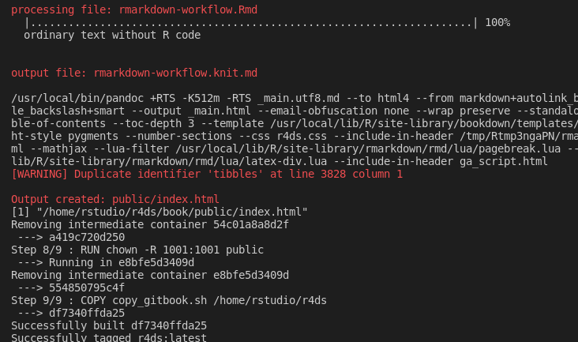

# r4ds bookdown

## Build the image

```
docker build -t r4ds .
```

What the **Dockerfile** does:

1.  Pull the image for R-3.6.3

    ```
    # BUILD_DATE for R-3.6.3 is 2020-04-24
    FROM rocker/verse:3.6.3
    ```

2.  Create folder `/home/rstudio/r4ds` inside the image

    ```
    RUN . /etc/environment \
        && mkdir /home/rstudio/r4ds
    ```

3.  Copy the book source files under local folder `book` to image folder `/home/rstudio/r4ds/book/`:

    ```
    # when copying a folder we have to specify the destination folder as well
    COPY book /home/rstudio/r4ds/book/
    ```

4.  Copy the `DESCRIPTION` file to image folder `/home/rstudio/r4ds/`:

    ```
    # we don't copy everything because we have a single file left at the end
    COPY DESCRIPTION /home/rstudio/r4ds/
    ```

5.  Install book dependencies using DESCRIPTION as a dummy package constructor

    ```
    RUN R -e "devtools::install(\
        '/home/rstudio/r4ds', \
        keep_source=TRUE, \
        args='--install-tests', \
        dependencies=TRUE)"
    ```

6.  Change default folder to `/home/rstudio/r4ds/book`

    ```
    # output folder for the book
    WORKDIR /home/rstudio/r4ds/book
    ```

7.  Build the book

    ```
    # build gitbook with bookdown
    RUN Rscript -e 'bookdown::render_book(input = "index.Rmd",\
                          output_format = "bookdown::gitbook",\
                          output_dir = "public", clean_envir = FALSE)'
    ```

8.  Assign user permissions to the `public` output folder under `/home/rstudio/r4ds/book/`.

    ```
    RUN chown -R 1001:1001 public
    ```

9.  From the local folder, copy the script `copy_gitbook.sh` to the image folder `/home/rstudio/r4ds`. This script will take care of copying the `public` folder in the container to the local machine.

    ```bash
    #!/bin/bash
    # copy_gitbook.sh
    #
    echo "Will start copying output files to share folder ..."
    cp -avr public/ ../../share/
    ```




This is how it looks at the end of the Docker build process. The last Docker operation is copying the script `copy_gitbook.sh`.


## Run the container

There are several options to get access to the book and the output generated by bookdown in the Docker container by means of running a container of the image.

* **Option 1:** This command will copy the `public` folder to the `share` folder. Note that this command doesn't require to load RStudio in a browser; it only executes a script.
  
  ```
  docker run --rm \
  	-v $PWD/share:/home/rstudio/share \
  	r4ds \
  	../copy_gitbook.sh
  ```
  
  -   `-v $PWD/share:/home/rstudio/share`: connect the container folder `/home/rstudio/share` with the local folder `$PWD/share`. The environment variable `$PWD` contains the name of the current directory.
  -   `r4ds`: is the the name of the image
  -   `../copy_gitbook.sh`: location of the script to execute


* **Option 2:** With the next command we set up the `/home/rstudio/share` folder in the container that can be shared with the host machine under the current project folder. This is the classic way of sharing a container folder with a local folder. This command will enable an RStudio session to the project via [http://localhost:58787](http://localhost:58787).

```
docker run --rm -p 58787:8787 \
    -v $PWD/share:/home/rstudio/share  \
    -e USERID=$UID -e PASSWORD=r4ds \
    r4ds
```

* **Option 3:** With this other command, we will be sharing the book with the volume `bookdown-r4ds`. Also we are making available a local share to the current project folder. This command requires that we have created the volume `bookdown-r4ds` in advance with`docker volume create bookdown-r4ds`.
```
docker run --rm -p 58787:8787 \
    -v $PWD/share:/home/rstudio/share  \
    --mount source=bookdown-r4ds,destination=/home/rstudio/r4ds \
    -e USERID=$UID -e PASSWORD=r4ds \
    r4ds
```

**NOTE**
The following command will not allow us to share the book that was built in the image because it overwrites the output folder `r4ds`. It will show empty.

```
docker run --rm -p 58787:8787 \
    -v $PWD/share:/home/rstudio/r4ds  \
    -e USERID=$UID -e PASSWORD=r4ds \
    r4ds
```


## Scripts

The following shell script copies the output of the `bookdown::gitbook` to the folder `/home/rstudio/share` which is linked to the `share` folder under our current project.

```bash
#!/bin/bash
# copy_gitbook.sh
#
echo "Will start copying output files to share folder ..."
cp -avr public/ ../../share/
```

